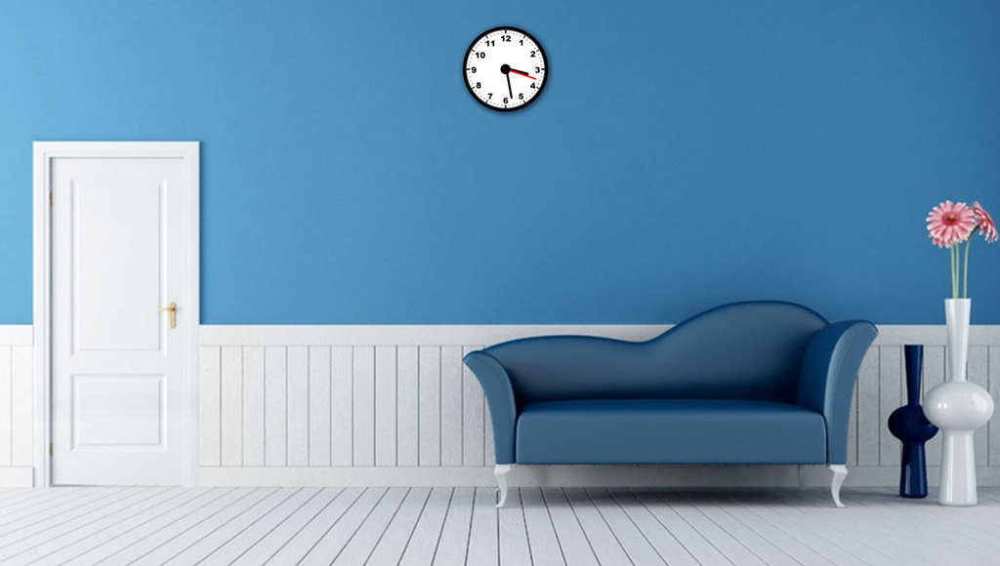

# JavaScript Assignment 2 - Analog Clock
- [Preview](#preview)
- [index.html](#preview)
- [Preview](#preview)
- [Preview](#preview)

##Preview


##index.html
```
<!DOCTYPE html>
<html>

<head>
  <meta charset="UTF-8">
  <meta name="viewport" content="width=device-width, initial-scale=1.0">
  <link rel="stylesheet" type="text/css" href="css/styles.css">
  <title>Analog Clock</title>
</head>

<body onload="rotate();">

  <div class="clock">
    <div class="hand hour"></div>
    <div class="hand minute"></div>
    <div class="hand second"></div>
  </div>
  <script type="text/javascript" src="js/script.js"></script>
</body>
</html>
```
##style.css
```
body {
	  min-width: 100vw;
	  min-height: 100vh;
	  overflow: hidden;
	  background-image: url('../img/bg.jpg');
	  background-repeat: no-repeat;
  	  background-size: 100% 100%;
	  display: flex;
	  justify-content: center;
	  /*align-items: center;*/
	}

	/* clock */

	.clock {
	  width: 120px;
	  height: 120px;
	  top:50px;
	  background-image: url('../img/clock1.jpg');
	  border-radius: 50%;
	  border: 5px solid #000;
	  box-shadow: 2px 2px 8px 2px rgba(22, 45, 75, 0.92);
	  background-size: cover;
	  position: relative;
	}

	/* clock style ends */

	/* round center */

	.clock::before {
	  content: '';
	  width: 15px;
	  height: 15px;
	  border-radius: 50%;
	  background-color: #000;
	  position: absolute;
	  top: 50%;
	  left: 50%;
	  transform: translate(-50%, -50%);
	  z-index: 999;
	}

	/* round center style ends */

	/* common style for every hand */

	.hand {
	  position: absolute;
	  bottom: 50%;
	  left: 50%;
	  transform: translateX(-50%) rotate(90deg);
	  transform-origin: bottom;
	  border-top-left-radius: 7px;
	  border-top-right-radius: 7px;
	}

	/* common style ends */

	/* hour hand */

	.hour {
	  width: 5px;
	  height: 28%;
	  background-color: #000;
	}

	/* hour hand style ends */
	/* minute hand style */

	.minute {
	  width: 3px;
	  height: 38%;
	  background-color: #000;
	}

	/* minute hand style ends */
	/* second hand style */

	.second {
	  width: 2px;
	  height: 40%;
	  background-color: #ff0000;
	}

	/* second hand style ends */
```

##script.js
```
// grab a reference of every hands

	// hour hand
	let hourHand = document.querySelector('.hour');
	// minute hand 
	let minuteHand = document.querySelector('.minute');
	// second hand
	let secondHand = document.querySelector('.second');

	// function that rotates the hands
	function rotate() {

	  // get the current Date object from which we can obtain the current hour, minute and second
	  const currentDate = new Date();

	  // get the hours, minutes and seconds
	  const hours = currentDate.getHours();
	  const minutes = currentDate.getMinutes();
	  const seconds = currentDate.getSeconds();

	  // rotating fraction --> how many fraction to rotate for each hand.
	  const secondsFraction = seconds / 60;
	  const minutesFraction = (secondsFraction + minutes) / 60;
	  const hoursFraction = (minutesFraction + hours) / 12;

	  // actual deg to rotate
	  const secondsRotate = secondsFraction * 360;
	  const minutesRotate = minutesFraction * 360;
	  const hoursRotate = hoursFraction * 360;

	  // apply the rotate style to each element
	  // use backtick `` instead of single quotes ''
	  secondHand.style.transform = `rotate(${secondsRotate}deg)`;
	  minuteHand.style.transform = `rotate(${minutesRotate}deg)`;
	  hourHand.style.transform = `rotate(${hoursRotate}deg)`;

	  // for every 1000 milliseconds(ie, 1 second) interval, activate the rotate() function.
		setInterval(rotate, 1000);
	}
```

* * *
[Back to Top](#basic-git-commands)
