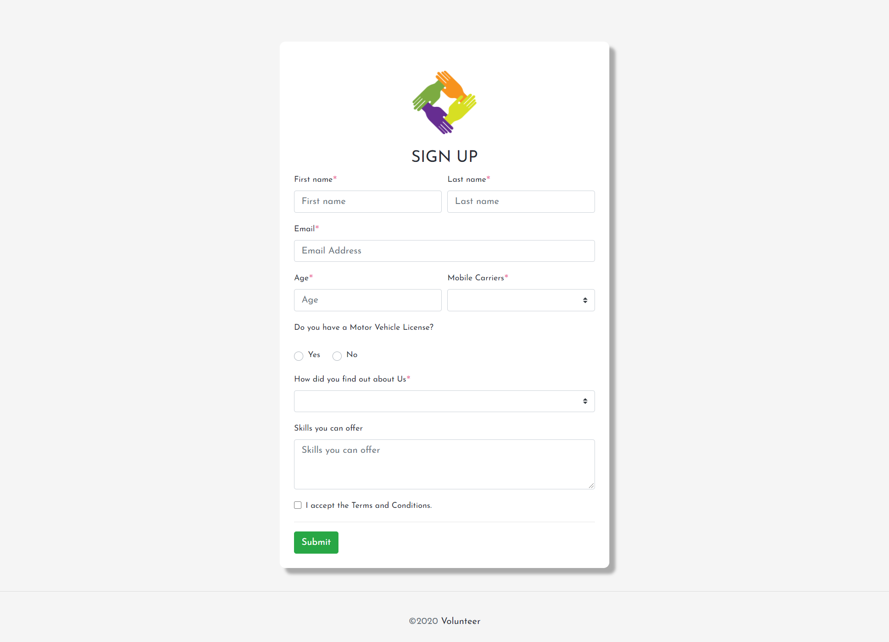
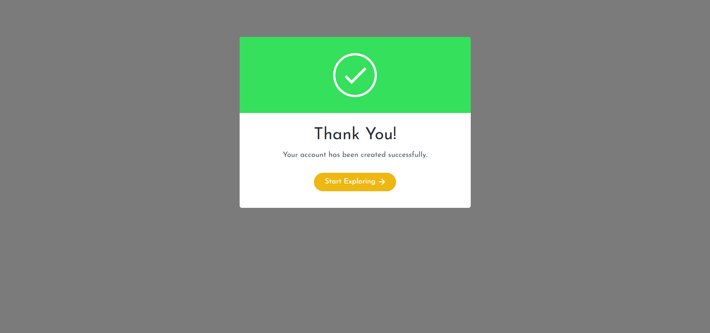
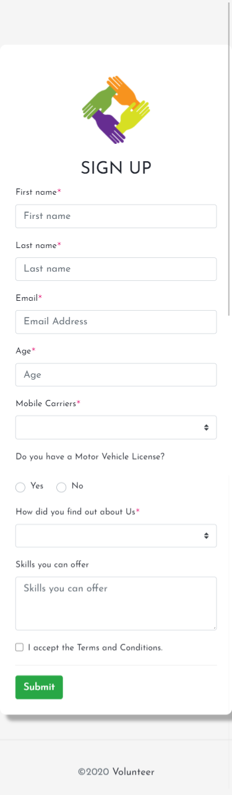

# HTML-CSS Assignment - Signup Form for a Volunteer Program

- [Validation](#validation)
- [Style](assets/css)
- [Script](assets/js)
- [Font](assets/fonts)
- [Preview](#preview)

## Preview




## Validation

```

	// Example starter JavaScript for disabling form submissions if there are invalid fields
	(function() {
	  'use strict';
	  window.addEventListener('load', function() {
	  	
	    // Fetch all the forms we want to apply custom Bootstrap validation styles to
	    var forms = document.getElementsByClassName('needs-validation');
	    // Loop over them and prevent submission
	    var validation = Array.prototype.filter.call(forms, function(form) {
	      form.addEventListener('submit', function(event) {

	        if (form.checkValidity() === false) {
	          event.preventDefault();
	          event.stopPropagation();
	        }
	        
	        form.classList.add('was-validated');

	      }, false);

			var r1 = document.getElementById("customRadioInline1");
			r1.addEventListener("click", function() {
				document.getElementById("vehicle").hidden=false;
				document.getElementById("validationCustom07").disabled=false;
		}, false);

			var r2 = document.getElementById("customRadioInline2");
			r2.addEventListener("click", function() {
				document.getElementById("vehicle").hidden=true;;
				document.getElementById("validationCustom07").disabled=true;
		}, false);

	    });
	  }, false);
	})();

  
```


* * *
[Back to Top](#HTML-CSS Assignment - Signup Form for a Volunteer Program)
